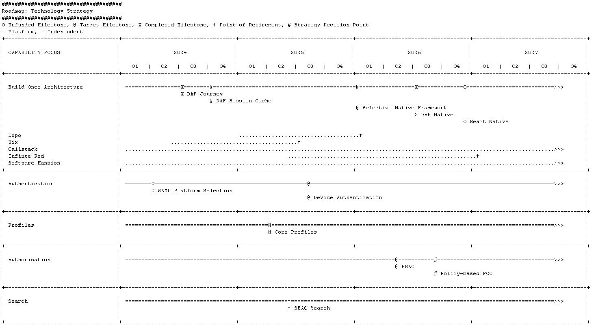

# Drawio Roadmaps

Generate consistently looking architecture roadmap views from data.

#### Renderers

- ASCII
- Drawio (To Do)

#### Loaders

- YAML
- CSV (To Do)
- Database (To Do)

This project allows users to create and visualize roadmaps in various formats, including ASCII and DrawIO, making it easier to plan and communicate project timelines and milestones.



## Features

- Load roadmap data from YAML files.
- Render roadmaps in ASCII format for quick visualization in text environments.
- Generate DrawIO files for detailed graphical representation.
- Flexible renderer system allowing for future expansion to other formats.

## Setup

To get started with this project, clone the repository and set up a virtual environment:

```
git clone https://github.com/<YourUsername>/<RepositoryName>.git
cd <RepositoryName>
python -m venv venv
source venv/bin/activate  # On Windows use `venv\Scripts\activate`
pip install -r requirements.txt
```


### Usage

To generate a roadmap, prepare your roadmap data in a YAML file and use the main script to load and render it:

```python main.py yaml examples/your_roadmap.yaml```

###ASCII Output Example

Here's an example of an ASCII-rendered roadmap:

### Generating DrawIO Files (To Do)

To generate a DrawIO-compatible XML file:

```python main.py drawio examples/your_roadmap.yaml```

The output XML file can be imported into DrawIO for graphical editing and presentation.

### Contributing

Contributions are welcome! If you'd like to contribute, please fork the repository and use a feature branch. Pull requests are warmly welcome.

