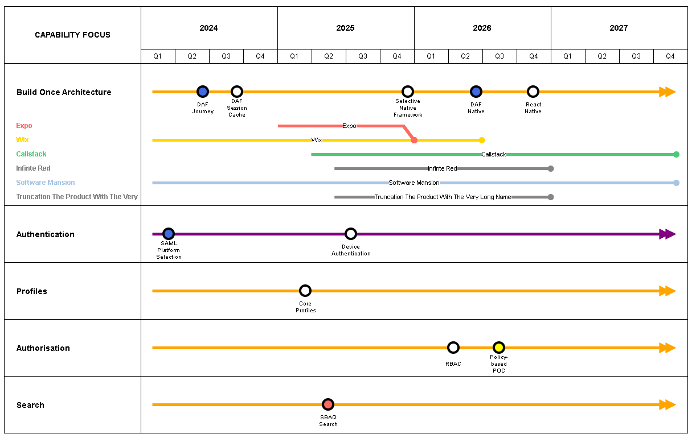

# Drawio Roadmaps

Generate consistently looking architecture roadmap views from data.

#### Renderers

- ASCII
- Drawio 
- PowerPoint (To Do)

#### Loaders

- YAML
- CSV 
- Database

This project allows users to create and visualize roadmaps in various formats, including ASCII and DrawIO, making it easier to plan and communicate project timelines and milestones.

#### ASCII Output Example


#### Drawio Output Example



## Features

- Load roadmap data from YAML files.
- Render roadmaps in ASCII format for quick visualization in text environments.
- Generate DrawIO files for detailed graphical representation.
- Flexible renderer system allowing for future expansion to other formats.

## Setup

To get started with this project, clone the repository and set up a virtual environment:

```
git clone https://github.com/<YourUsername>/<RepositoryName>.git
cd <RepositoryName>
python -m venv venv
source venv/bin/activate  # On Windows use `venv\Scripts\activate`
pip install -r requirements.txt
```

## Usage

To generate a roadmap, prepare your roadmap data and use the follwing command syntax:

```python main.py <source_type> <renderer_type> <source_path>```


### Generating Roadmaps from YAML Files
```
python main.py yaml ascii examples/roadmap.yaml
python main.py yaml drawio examples/roadmap.yaml
WIP do not use - python main.py yaml powerpoint examples/roadmap.yaml
```
The output XML file can be imported into DrawIO for graphical editing and presentation.

### Generating Roadmaps from CSV Files
```
python main.py csv ascii examples/roadmap.csv
python main.py csv drawio examples/roadmap.csv
WIP do not use - python main.py csv powerpoint examples/roadmap.csv
```

### Generating Roadmaps from Database (SQLite)
```
python main.py database ascii examples/roadmap.csv
python main.py database drawio examples/roadmap.csv
WIP do not use - python main.py database powerpoint examples/roadmap.csv

### Using "Inspect Drawio"
This script and the associated example file examples\inspect.drawio, are intended to allow for quick view of what a particular style looks like in XML. First edit the .drwaio file to your liking and then output the inner XML by running

```python inspect_drawio.py examples/inspect.drawio```

which will give yout the pretty printed XML. You can then use this XML to tweak code an styling to your liking.

### Contributing

Contributions are welcome! If you'd like to contribute, please fork the repository and use a feature branch. Pull requests are warmly welcome.

